# lab1

> 本节目标：
>
> 1. 了解常用的工具与学习平台
> 2. 学习使用超星学习通，并通过邀请码加入课程
> 3. 配置C语言运行环境，并编译运行课程的第一个C程序

## 获取及提交lab

**获取**：通过 `https://github.com/FDU-C-2020/lab1`，获取（建议通过Download ZIP方式下载）。

**提交物**：将你完成目标3的步骤、最终的效果写个简要的文档（最好有截图说明，格式为word或者pdf，页数不超过5页），作为Lab1的提交物。

**提交**：将提交物文档命名为学号_姓名 （如20302010000_王明），提交至超星学习通对应的作业中。

**截止时间**：北京时间 2020年9月20日 23:59:59 

## 1.常用工具与学习平台

### 校园WIFI
推荐选择iFudanNG.1x或iFudan.1x。前者支持所有终端和操作系统，第一次配置成功后，只要在信号覆盖范围内，系统会自动连接。由于仅支持 5GHz 频段，来自外界的干扰很小，无线连接会更加稳定。

WIFI连接用户名为学号，密码与复旦UIS统一身份认证系统使用的密码一致（初始密码是身份证后6位）。

### 校园邮箱

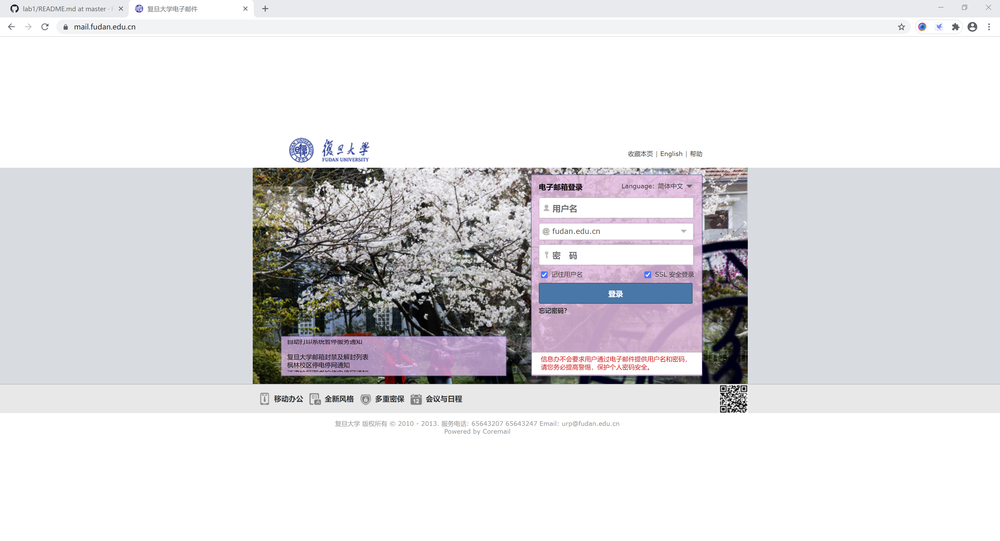

在读期间，校园邮箱将会是非常重要的工具。校园中相对严肃、重要的事务大多是通过邮箱进行通知的，这其中包括课程信息、社团信息、留学信息等。除此以外，它也将是同学与导师之间沟通的重要途径。希望大家能够养成定时查看学邮的习惯，重要信息一旦错过可能会比较麻烦（~~助教大一时就由于没查看学邮而鸽掉了自己非常喜欢的社团的面试~~）。

当然如果没有这个习惯，~~其实也没事儿~~，这里介绍一种代收邮件的方式。它将使用QQ邮箱服务器代收学邮邮件，这样你的学邮一旦收到了信件，QQ或者微信就会立即通知你（
<a href="https://github.com/little-pikachu/documents/blob/master/collect_fudan_mail.md" target="_blank">点击查看设置教程</a>）。

老学长的建议：不建议过度使用学邮！本科学邮在本科毕业后会收回！

### GitHub平台

如你所见，我们现在使用的就是GitHub平台。GitHub是很多开发者远程协作的重要工具，其社交化编码的理念伴随着开源运动改变着整个开发社区的生态，无数优质项目依托GitHub在全球开源开发者的参与下蓬勃发展。它常被开发者戏称为“全球最大~~同性~~交友社区(拥有三千万开发者)”（<a href="https://blog.csdn.net/qq_41782425/article/details/85183250" target="_blank">点击查看GitHub使用教程</a>）。

在编程领域，协作编程与代码托管一直都是经久不衰的话题。GitHub也是由此孕育而生。我们可以将自己的代码托管到平台中，这样就不用担心自己本地代码的丢失、污染（~~当手滑删掉了自己辛苦半个学期写的PJ的时候，就会知道备份的重要性了~~）。除此以外，这还是一个交流社区。在这里，你可以轻松的找到实现各种功能的代码。当你为了实现一个功能冥思苦想良久而不得后，不妨来这里找找灵感。

我们鼓励大家利用互联网资源进行学习，提倡同学间进行沟通交流。但是课程作业和PJ中严禁抄袭，一旦发现抄袭将会判定0分！！！ 

### CSDN 平台 与 StackOverFlow 平台

在今后的课程学习与实践开发过程中，难免会遇到问题。此时就需要借助搜索工具，如google、firefox、百度等进行查询。我们往往会在CSDN或StackOverFlow平台上找到相关答案。其中

1、CSDN是全球知名中文IT技术交流平台，创建于1999年，包含原创博客、精品问答、技术论坛等服务，提供原创、优质、完整内容的专业IT技术开发社区。

2、Stack Overflow is an open community for anyone that codes. We help you get answers to your toughest coding questions, share knowledge with your coworkers in private, and find your next dream job.

## 2.使用学习通

超星学习通是本课程的重要教学辅助工具。它可以用作课程学习、课堂互动、作业发布与收取、资源共享等。下面将对学习通APP进行简单的介绍。

### 登录

1、登录选项处选择其他登录方式：

2、在机构栏输入并选中复旦大学：

3、选中复旦大学后会弹出复旦大学统一身份认证页面，输入用户名和密码登录：

这样就通过使用复旦的认证平台登录了学习通（为了方便下一次登录，可以完善账户信息，绑定手机号以方便通过手机号登录）。

### 加入课程

1、在APP首页的右上角存在“邀请码”，点击邀请码后通过输入邀请码方式加入课程：

2、这里输入程序设计课程的邀请码-`83341795`，以加入课程：

### 其他功能

1、加入课程后点击该课程可以进入课程内容页面：

学习通中会在此处通知主题讨论的发布，课堂选人等。

2、点击“作业/考试”可以查看作业完成情况：

3、点击“章节”可以查看课程章节资源（主要是视频教学资源）：

## 3.运行本学期的第一个 C 程序 （for Windows，Mac系统用户可跳过）

接下来我们尝试运行第一个 C 程序—— `helloworld.c`。
如果你从来没有使用命令行运行过 C 程序，那很好，这就是我们所期望的。
在这一部分，请丢掉你的 IDE，跟着这篇文章重新学习。

### Step 1: 下载 MinGW 包管理器

第一步，我们需要下载 MinGW，它是管理各版本 gcc（C 语言[编译器](https://baike.baidu.com/item/%E7%BC%96%E8%AF%91%E5%99%A8)）的工具。通过它，我们能很快的安装 gcc，从而快速搭建 C 语言开发环境。

[点击这里下载 MinGW](https://osdn.net/projects/mingw/downloads/68260/mingw-get-setup.exe)

### Step 2: 安装 MinGW && 下载 gcc

有人可能发现下载的安装软件相当地小，只有几十K。
这是因为我们下载的只是一个包管理器，包管理器安装后才能继续安装编译器等组件。

注意，整个安装过程都是在线的，因此请不要断开网络。

首先打开安装程序，按照提示，以默认选项进行安装即可。

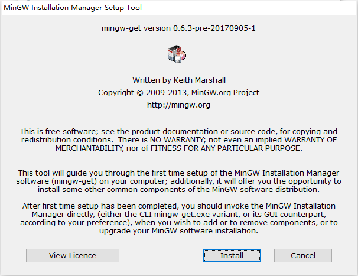

安装路径默认在 C 盘，你可以自己考虑是否放在 C 盘内

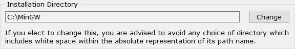

> 你可以自己设置路径，但是！**请务必记住该路径**，接下来需要使用到！

包管理器安装完成后将弹出这个界面：

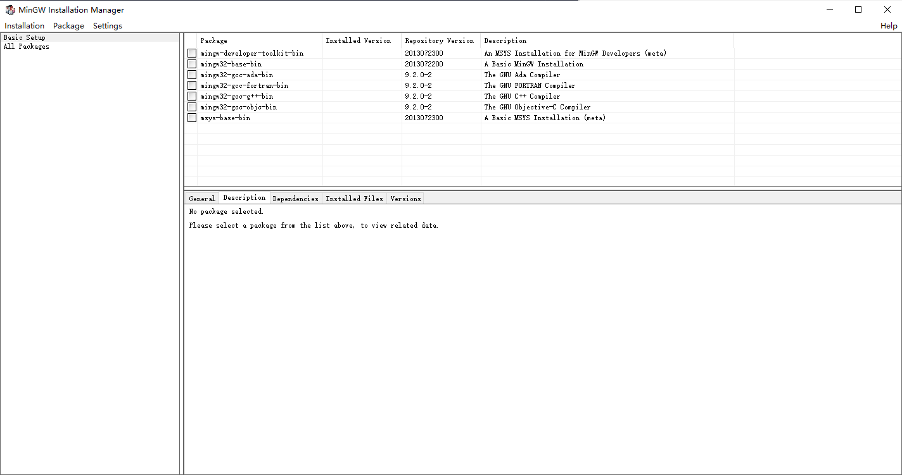

找到 `mingw32-gcc-g++-bin`，点击选择 `Mark for Installation`。

然后点击左上角的 `Installation` 菜单中的 `Apply changes` 选项，然后管理器将开始在线安装或更新被选中的组件。

下面耐心等待程序的安装。

安装完成后关闭包管理器，如果由于某种原因安装未能成功，在退出程序前程序将给予提示，选择 `review changes` 选项重新安装即可。

### Step 3: 配置环境变量

打开 控制面板 -> 系统和安全 -> 系统 -> 高级系统设置 -> 环境变量。

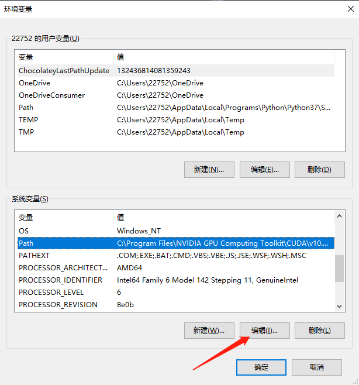

在系统环境变量列表中找到 `Path` 选项，点击编辑

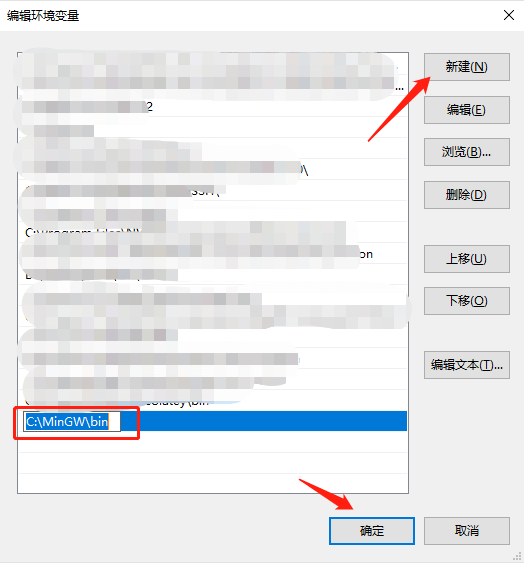

点击新建，找到 MinGW 安装路径下的 bin 文件位置，添加项

我这里的路径是 `C:\MinGW\bin`，如果你将 MinGW 安装在自己设置的路径，请使用**你自己的 MinGW 安装路径下的 bin 文件位置**

### Step 4: 检验

现在，按下 `Win 键 + R`，输入 `cmd` 并回车来打开（如果你已经打开，请重启）你的 CMD 命令行。

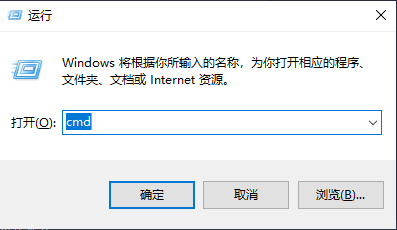

输入：

    $ gcc -v

测试 gcc 的版本，如果得到的结果与下面的结果类似，不是没有这种命令或文件的提示之类的话，就说明安装成功。

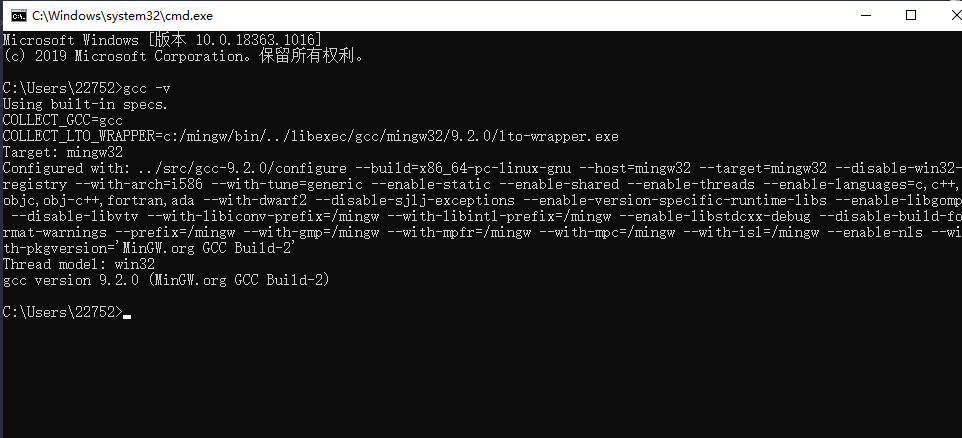

### Step 4: 运行 `helloworld.c`

在 `helloworld.c` 文件所在文件夹按住 Shift 鼠标右键，在菜单栏里点击 `在此处打开 Powershell 窗口` 项，打开 Powershell

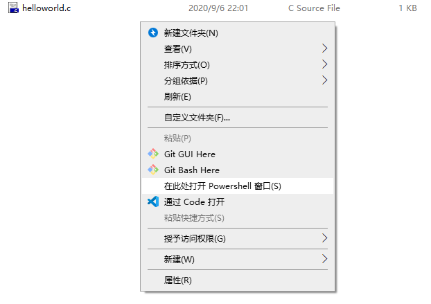

输入：

    $ gcc .\helloworld.c -o helloworld.exe

在同文件夹下生成 `helloworld.exe` 文件

再输入：

    $ helloworld.exe

命令行是否输出 `hello world` ？

如果你成功输出 `hello world`，相信你已经学会了如何使用命令行运行 C 程序了，恭喜你！

## 4.运行本学期的第一个 C 程序（for Mac，Windows系统用户可跳过）

### Step 1: 打开终端

`command + 空格` 打开聚焦搜索🔍，在搜索框中输入 `terminal`，点击下方 “终端” 或直接回车，即可打开终端

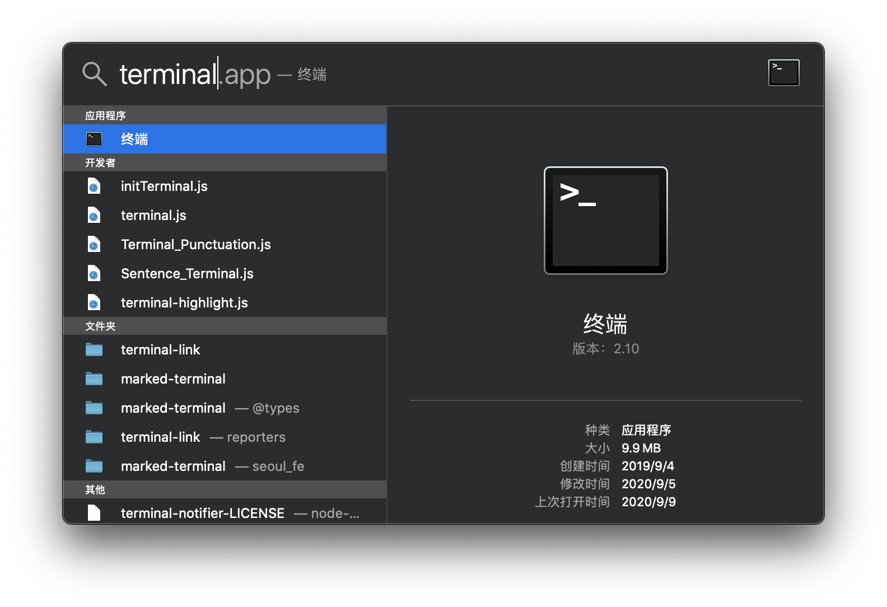

### Step 2: 进入所在文件夹

打开终端后，我们需要进入 helloworld.c 文件所在的文件夹。
可以在终端内输入 `cd` + 空格，然后使用访达打开文件夹，在将文件夹拖入终端，就能直接获得文件夹所在路径。

比如：我现在要通过终端进入 `lab1` 所在的文件夹。

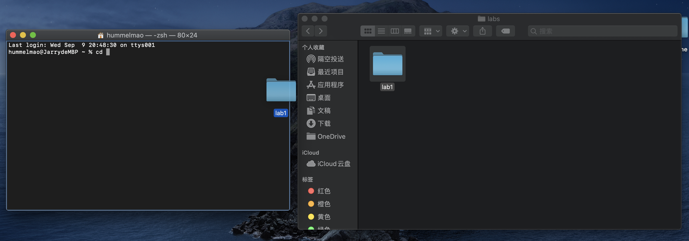

然后在终端内回车，就进入了 `lab1` 的文件夹。

> 你觉得以上操作太繁琐？试试[这个](https://jingyan.baidu.com/article/ce436649281a293773afd3d8.html)

### Step 3: 检查是否安装 `gcc`

在终端输入：

    $ gcc -v

若终端返回以下内容，则说明你已经安装好 `gcc` 了，若没有返回类似内容，你需要在 `App Store` 内下载 `Xcode` 软件，再重新打开终端尝试。

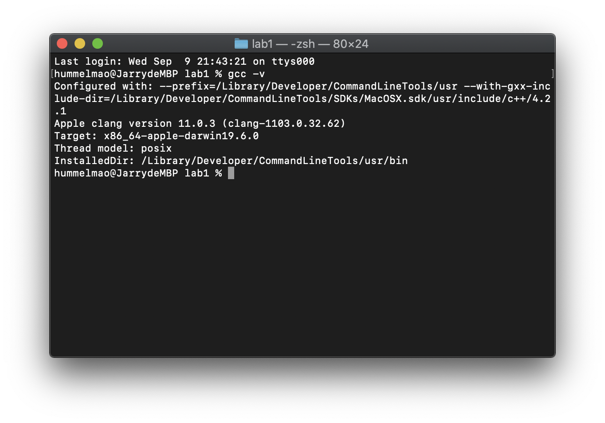

### Step 4: 编译并运行 `helloworld.c`

在 `helloworld.c` 所在文件夹打开终端，输入：

    $ gcc ./helloworld.c -o helloworld.out

会在同文件夹下生成 `helloworld.out` 文件

再输入：

    $ helloworld.out

看看你是否输出 `hello world` ？

